# 🛒 Meal Planning App(PlaniShop)

A **Flutter** application built with **Clean Architecture** that helps users plan their meals, manage grocery lists, and explore suggested recipes.  
It integrates with **Firebase** for authentication and data storage and **TheMealDB API** for fetching suggested meals.

---

## 🚀 Features

### 🏁 Splash Screen
- A beautiful animated **Splash View** that introduces the app.
- Checks user authentication state:
  - If logged in → navigates to Home.
  - If not → navigates to Onboarding or Login screen.
- Built with **Cubit** for state handling and navigation control.

### 🧭 Onboarding
- A smooth onboarding experience introducing the app’s main features.  

### 🧾 Grocery Module
- Fetch grocery items categorized by type from **Firestore**.
- Each item supports:
  - ✅ Add to Cart
  - ❤️ Mark as Favorite
- All actions are synced with **Firebase** collections based on the logged-in user’s ID.

### 🍽 Suggested Meals
- Fetch meals dynamically from **TheMealDB API**.
- Displays a curated list of meal suggestions for inspiration.

### 🍴 Meal Description View
- A detailed screen for each meal containing:
  - 🧂 **Ingredients**
  - 📜 **Instructions**
  - 🧮 **Nutrition Summary**
  - 🖼️ **Meal Image**
- Built using **Clean Architecture** and **Cubit** for state management.
- Includes a fixed **🎥 “Watch Recipe Video”** button that allows the user to view the recipe video fetched from the API.
- Smooth scroll behavior with a **floating button** overlay.

### 🧠 Nutrition Summary (Spoonacular API Integration)
- Integrated **Spoonacular API** for advanced nutritional data.
- Uses the **Recipe Analyze Endpoint** to fetch accurate nutrient breakdown:
  - Calories
  - Protein
  - Fat
  - Carbohydrates
  - Sugar
- Data displayed inside a clean, responsive **NutritionSummary widget**.
- Replaces or complements TheMealDB data for better precision.

### 🛍 Cart Management
- Items can be added/removed from the cart.
- Cart items are stored in a dedicated Firestore collection under the current user’s ID.
- Real-time updates and state management handled using **Cubit (Bloc)**.

### ❤️ Favorites
- Users can mark grocery items as favorites.
- Stored in a user-specific Firestore collection.
- Easily accessible in the Favorites view.

### 👤 Authentication
- Firebase Authentication integrated.
- Supports:
  - 📧 Email/Password Login
  - 🔵 Google Login
  - 🔵 Facebook Login
- Securely handles user sessions and data isolation.

## 🧩 Architecture

This app follows the **Clean Architecture pattern**, ensuring maintainability, scalability, and separation of concerns.

📦 **lib/**  
 ┣ 📂 **core/**  
 ┃ ┣ 📂 constants/  
 ┃ ┣ 📂 utils/  
 ┃ ┣ 📂 widgets/  
 ┃ ┗ 📂 manager/  
 ┃  
 ┣ 📂 **features/**  
 ┃ ┣ 📂 auth/  
 ┃ ┃ ┣ 📂 domain/  
 ┃ ┃ ┣ 📂 data/  
 ┃ ┃ ┗ 📂 presentation/  
 ┃ ┃  
 ┃ ┣ 📂 home/  
 ┃ ┃ ┣ 📂 domain/  
 ┃ ┃ ┣ 📂 data/  
 ┃ ┃ ┗ 📂 presentation/  
 ┃ ┃  
 ┃ ┣ 📂 meals/  
 ┃ ┃ ┣ 📂 domain/  
 ┃ ┃ ┣ 📂 data/  
 ┃ ┃ ┗ 📂 presentation/  
 ┃ ┃  
 ┃ ┣ 📂 onboarding/  
 ┃ ┃ ┗ 📂 presentation/  
 ┃ ┃  
 ┃ ┗ 📂 splash/  
 ┃ ┃ ┗ 📂 presentation/  
 ┃  
 ┗ 📄 main.dart  

Each feature includes:
- `data/` → repositories, Firebase/HTTP logic  
- `domain/` → models and business logic  
- `presentation/` → UI and Cubits for state management
---

## 🧠 State Management
The project uses **Bloc/Cubit** from `flutter_bloc` for:
- Authentication flow
- Data fetching (Firestore / APIs)
- Cart and favorites updates
- UI states (loading, success, error)
- Splash navigation and initial route handling

---

## 🗄 Tech Stack

| Category | Technology |
|-----------|-------------|
| **Frontend** | Flutter (Dart) |
| **State Management** | Bloc / Cubit |
| **Backend** | Firebase Firestore |
| **Authentication** | Firebase Auth (Google, Facebook) |  
| **API** | TheMealDB API, SpoonAcular API |  
| **Architecture** | Clean Architecture |
| **Design Pattern** | Repository Pattern |

---

## 📸 Screenshots

### 🖼 App Preview

| Splash_View | Onboarding 1 | Onboarding 2 | Onboarding 3 | Onboarding 4 |  
|:------------:|:------------:|:------------:|:------------:|:------------:|
| 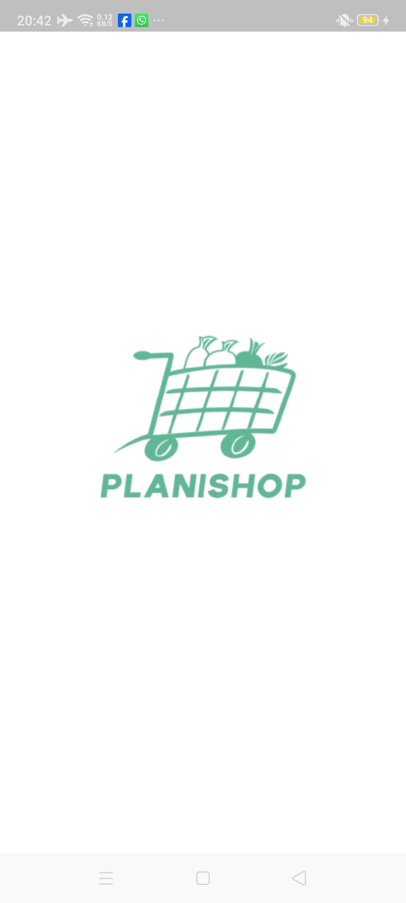 | 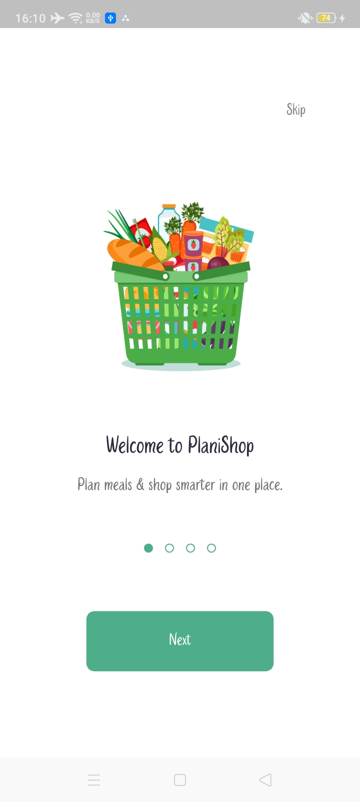 | 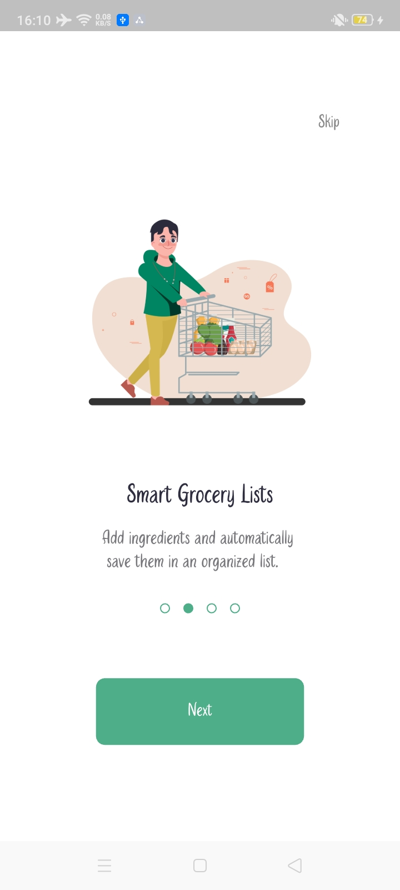 | 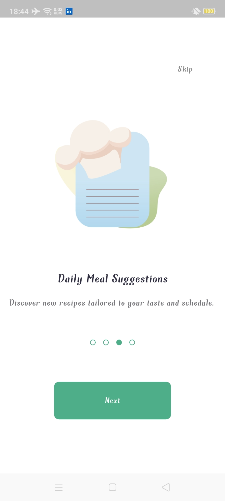 | 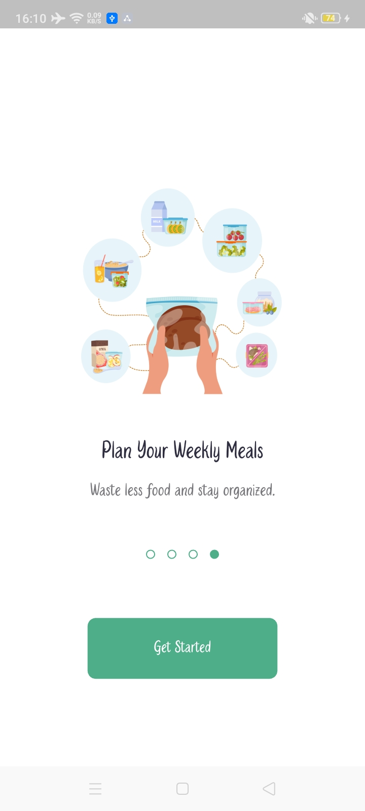 |

---

| Login 1 | Login 2 | CartView | Favorites |
|:-------:|:-------:|:--------:|:---------:|
| 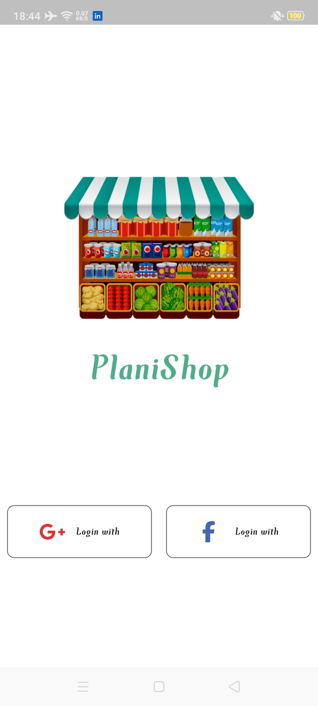 | 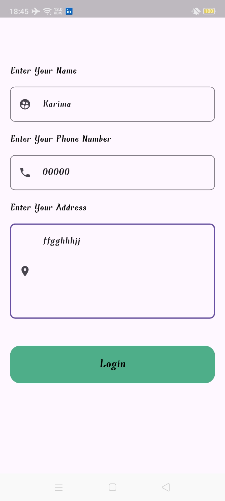 | 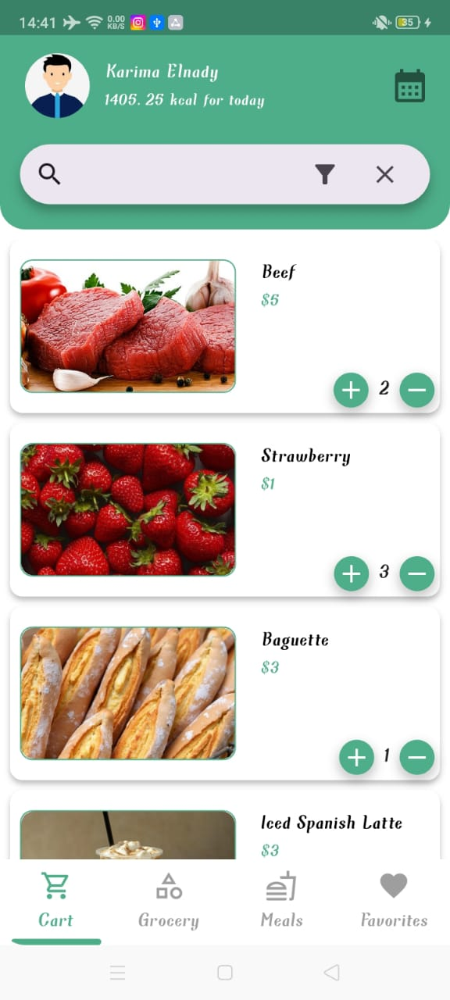 | 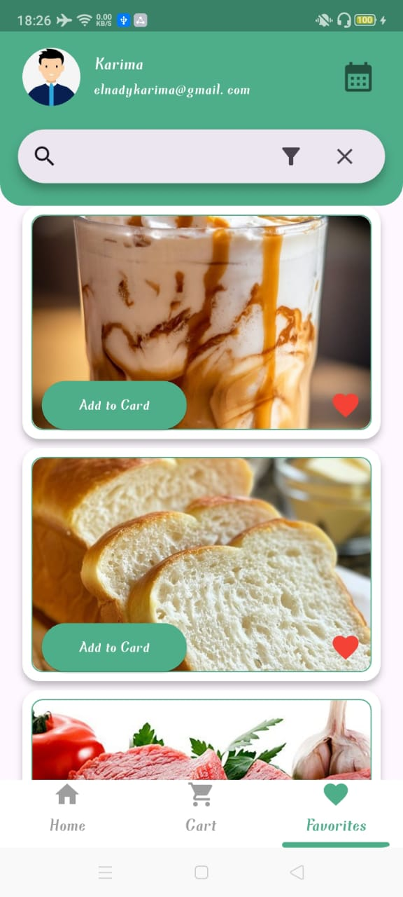 |  

---

| Grocery 1 | Grocery 2 | Grocery 3 | Grocery 4 | Grocery 5 |  
|:---------:|:---------:|:---------:|:---------:|:---------:|
| 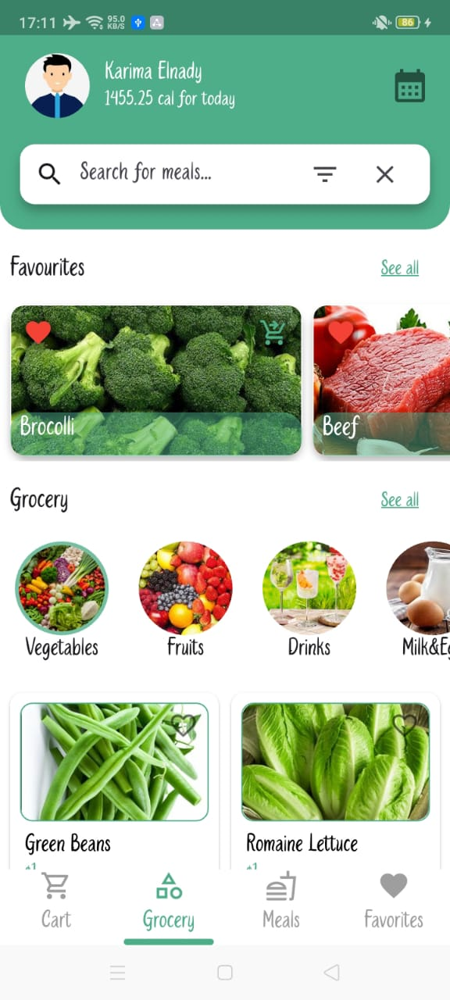 | 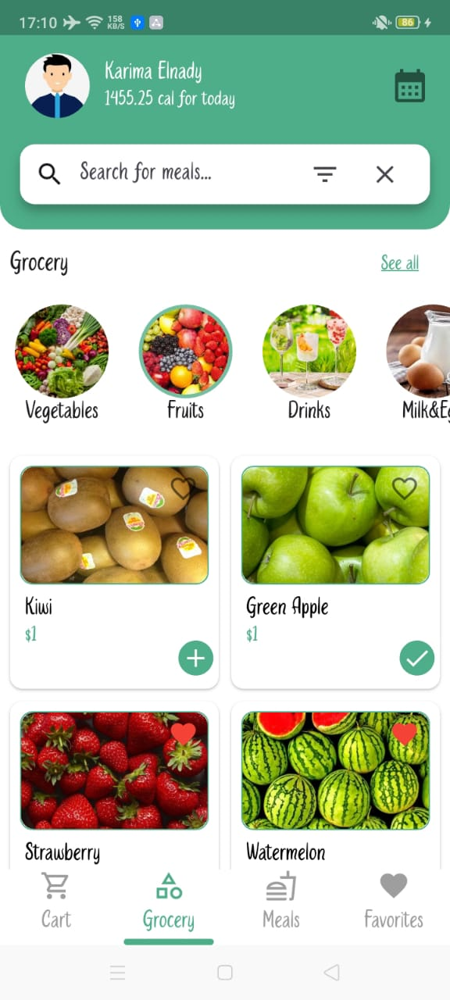 |  | 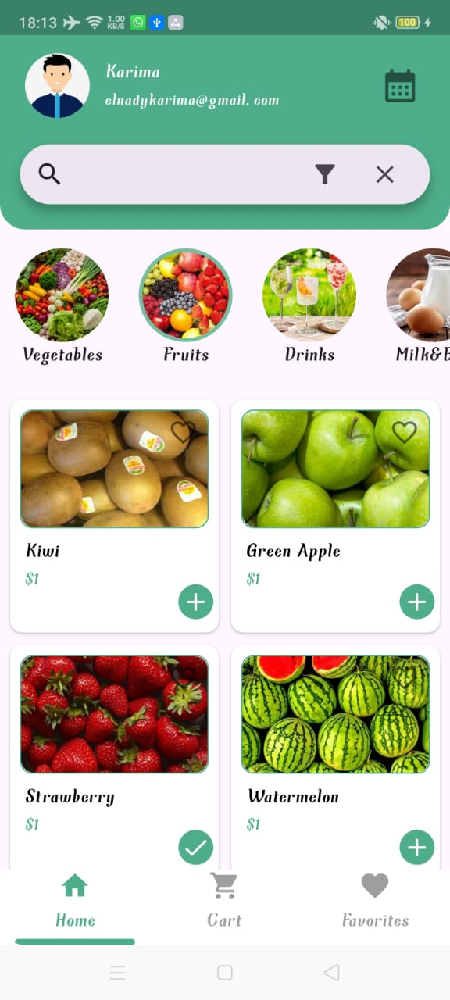 | 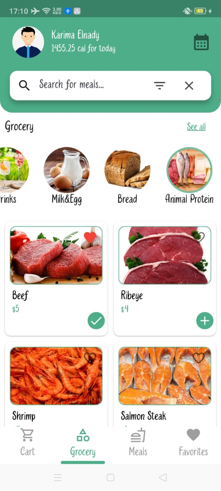 |  

---

| Categories | MealView | Description | FavMeals |
|:----------:|:--------:|:-----------:|:--------:|
| 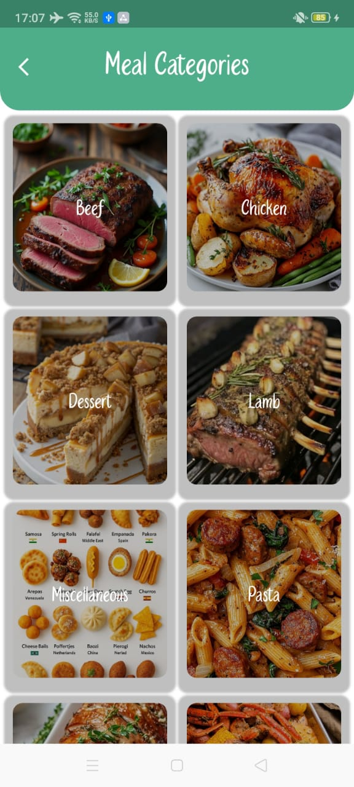 | 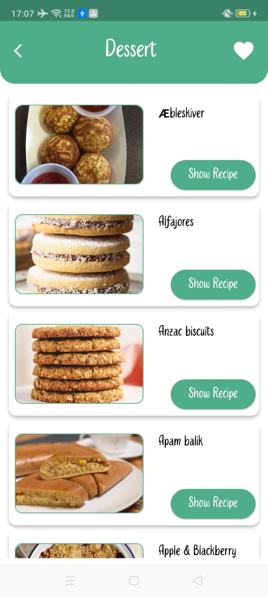 | 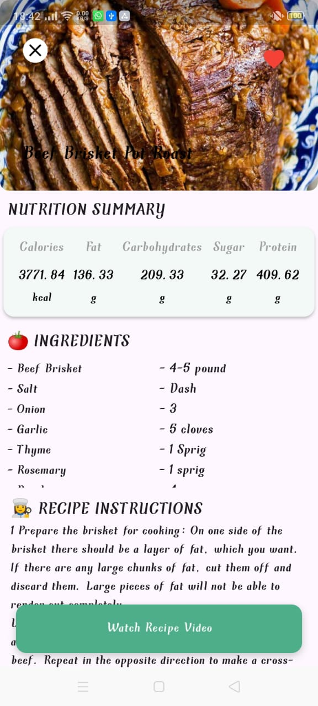 | 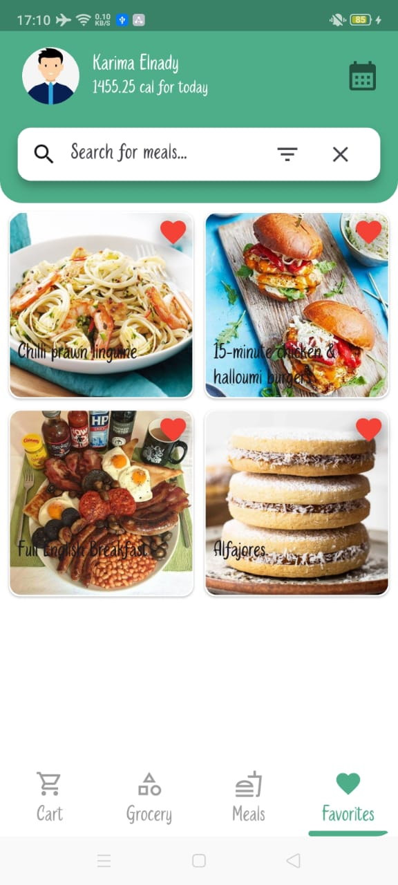 |  

---
## 🚀 Upcoming Features

Here are some of the planned enhancements that will be added soon:

- 🗓️ **Meal Planner Calendar** — plan your weekly meals easily  
- 📦 **Offline Mode** — browse saved data using local caching  
- 🔔 **Push Notifications** — get daily meal suggestions and reminders  
- 🌙 **Dark Mode Support** — enjoy a better experience at night  
- 🧪 **Unit Tests** — ensure stability and reliability for Cubits and repositories  

---

## 🚧 Project Status
This app is still under active development.  
More features, improvements, and UI updates will be added soon — stay tuned! 🌱
