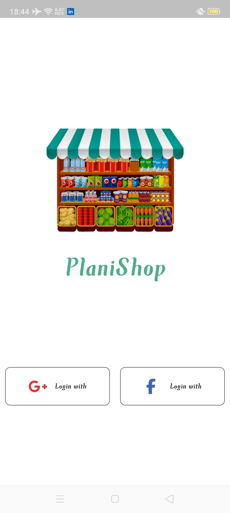
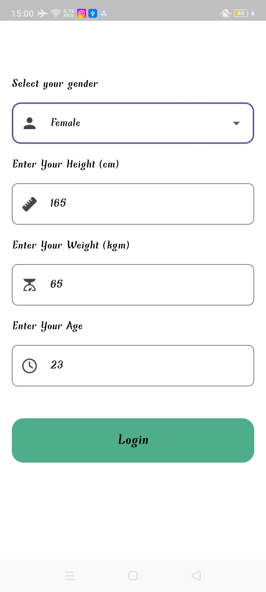
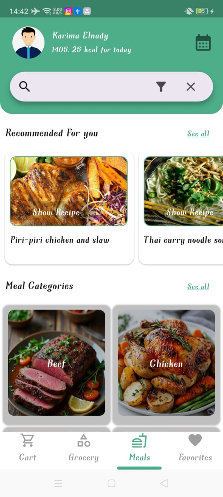
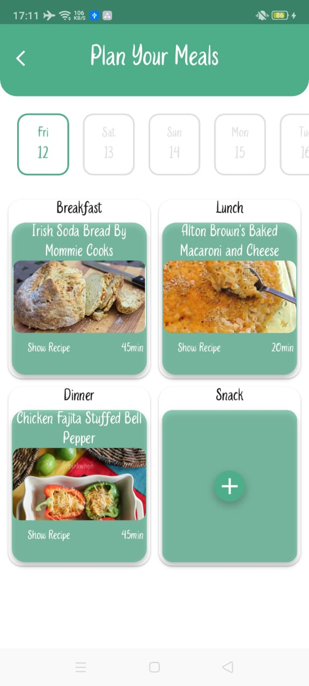

# 🛒 **PlaniShop – Meal Planning & Grocery Management App**
PlaniShop is a **Flutter** application built using **Clean Architecture**, designed to help users plan their meals, manage grocery lists, track daily calories, and explore suggested recipes.  
It integrates:

- **Firebase Authentication**  
- **Firebase Firestore**  
- **TheMealDB API** for meal suggestions  
- **Spoonacular API** for advanced nutritional analysis  

---

# 🚀 **Features**

## 🏁 **Splash Screen**
A clean, animated splash experience that introduces the app on startup.

- Smooth fade-in animation  
- Automatic navigation to the Onboarding flow or Home (depending on auth state)

---

## 🧭 **Onboarding**
A multi-screen onboarding flow introducing the main capabilities of PlaniShop:

- How to browse groceries  
- How to explore meals  
- Nutrition tracking  
- Favorites  
- Personalized meal planning  

Created to help new users understand the app quickly and clearly.

---

## 🔐 **Authentication (Google / Facebook / Email)**
The app uses **Firebase Authentication** with:

- Login with Google  
- Login with Facebook  
- Email + Password login  

### Authentication Flow:
1. App checks the Firebase login response.  
2. If `isNewUser = false` → navigate directly to **Home**.  
3. If `isNewUser = true` → navigate to **Complete User Information Screen** to gather essential health data.

This ensures personalized meal planning from day one.

---

## 👤 **Complete User Information Screen**
This screen is displayed only for new users.

### Users must provide:
- **Gender** (Male / Female) — via a dropdown  
- **Height** in cm  
- **Weight** in kg  
- **Age** in years  

### What happens next:
1. The app calculates the user’s **daily calorie requirement (BMR)**.  
2. All values are saved in Firestore under `users/{uid}`.  
3. The calculated calories are used in all future **meal planning features**.

---

## 🔢 **Calorie Calculation (BMR)**
PlaniShop uses standard BMR equations.

### For Males:
- BMR = 10 * weight + 6.25 * height - 5 * age + 5
### For Females:
- BMR = 10 * weight + 6.25 * height - 5 * age - 161
  
The resulting calorie value is stored in Firestore and becomes the limit for generating daily meal plans.

## 🧾 **Grocery Module**
Fetches grocery items categorized by type from Firestore.

### Each item supports:
- **Add to Cart**
- **Mark as Favorite**

### Technical Behavior:
- Every action updates Firestore in real-time  
- All data is isolated to the authenticated user using their Firebase `uid`  
- Cubit manages the entire state (loading → success → error)

---

## 🍽 **Suggested Meals (TheMealDB)**
Displays a list of recommended meals retrieved from **TheMealDB API**:

- Daily recommended meals  
- Category-based browsing (Beef, Poultry, Breakfast, etc.)  
- Eye-catching cards with images + meal names  

---

## 🍴 **Meals List & Categories**
Selecting a category loads all meals belonging to that category.

Each meal card contains:
- Meal image  
- Meal name  
- Tap → Meal Description View  

---

## 📖 **Meal Description View**
A detailed screen that shows everything about the selected meal.

### Includes:
- 🖼 High-quality meal image  
- 🧂 List of ingredients  
- 📜 Cooking instructions  
- 🧮 Nutrition Summary  
- 🎥 Button: **“Watch Recipe Video”** (opens YouTube link)

### Additional UX Features:
- Floating button for recipe video  
- Smooth scrolling  
- Built with Clean Architecture + Cubit  

---

## 🧠 **Nutrition Summary (Spoonacular API)**
Uses the **Recipe Analyze Endpoint** to calculate food nutrients with high accuracy.

Returns:
- **Calories**
- **Protein**
- **Fat**
- **Carbohydrates**
- **Sugar**

These values are displayed inside a custom widget for easy interpretation.

---

## 🍱 Weekly Meal Planner (Under Development)

The Meal Planner module generates a fully personalized **7-day meal plan** based on the user’s daily calorie requirement.  
Calorie limits are calculated automatically during profile setup using user data (gender, age, height, weight), then used to generate meals through the **Spoonacular API**.

### 🔧 How It Works
- A complete weekly plan is created, with a dedicated **Breakfast**, **Lunch**, and **Dinner** for every day.
- Users can easily navigate between days using the top horizontal day selector.
- Each meal card shows:
  - Meal image  
  - Meal name  
  - Duration  
  - “Show Recipe” button 

---

## 🛍 **Cart Management**
A dedicated Firestore collection for each user:

- Add/remove grocery items  
- Real-time UI updates via Cubit  
- Auto-sync across devices  

---

## ❤️ **Favorites**
Users can:

- Mark grocery items as favorites  
- Store them in `users/{uid}/favorites`  
- Access them instantly in a separate Favorites screen  

---

## 🧩 Architecture

This app follows the **Clean Architecture pattern**, ensuring maintainability, scalability, and separation of concerns.

📦 **lib/**  
 ┣ 📂 **core/**  
 ┃ ┣ 📂 constants/  
 ┃ ┣ 📂 utils/  
 ┃ ┣ 📂 widgets/  
 ┃ ┗ 📂 manager/  
 ┃  
 ┣ 📂 **features/**  
 ┃ ┣ 📂 auth/  
 ┃ ┃ ┣ 📂 domain/  
 ┃ ┃ ┣ 📂 data/  
 ┃ ┃ ┗ 📂 presentation/  
 ┃ ┃  
 ┃ ┣ 📂 home/  
 ┃ ┃ ┣ 📂 domain/  
 ┃ ┃ ┣ 📂 data/  
 ┃ ┃ ┗ 📂 presentation/  
 ┃ ┃  
 ┃ ┣ 📂 meals/  
 ┃ ┃ ┣ 📂 domain/  
 ┃ ┃ ┣ 📂 data/  
 ┃ ┃ ┗ 📂 presentation/  
 ┃ ┃  
 ┃ ┣ 📂 onboarding/  
 ┃ ┃ ┗ 📂 presentation/  
 ┃ ┃  
 ┃ ┗ 📂 splash/  
 ┃ ┃ ┗ 📂 presentation/  
 ┃  
 ┗ 📄 main.dart  

Each feature includes:
- `data/` → repositories, Firebase/HTTP logic  
- `domain/` → models and business logic  
- `presentation/` → UI and Cubits for state management
---

## 🧠 State Management
The project uses **Bloc/Cubit** from `flutter_bloc` for:
- Authentication flow
- Data fetching (Firestore / APIs)
- Cart and favorites updates
- UI states (loading, success, error)
- Splash navigation and initial route handling

---

## 🗄 Tech Stack

| Category | Technology |
|-----------|-------------|
| **Frontend** | Flutter (Dart) |
| **State Management** | Bloc / Cubit |
| **Backend** | Firebase Firestore |
| **Authentication** | Firebase Auth (Google, Facebook) |  
| **API** | TheMealDB API, SpoonAcular API |  
| **Architecture** | Clean Architecture |
| **Design Pattern** | Repository Pattern |

---

## 🖼 App Preview

| Splash_View | Onboarding 1 | Onboarding 2 | Onboarding 3 | Onboarding 4 |  
|:------------:|:------------:|:------------:|:------------:|:------------:|
|  |  |  |  |  |

---

| Login With | Compelete Info | Cart View |   
|:----------:|:--------------:|:---------:|
|  |  |  |  

---

| Grocery 1 | Grocery 2 | Grocery 3 | Grocery 4 | Grocery 5 |  
|:---------:|:---------:|:---------:|:---------:|:---------:|
|  |  |  |  |  |  

---

| SuggestedMeals | FavouriteMeals | WeeklyMealPlan | 
|:--------------:|:--------------:|:--------------:|
|  |  |  

---

| MealCategories | CategoryMeals | MealDescription |  
|:--------------:|:-------------:|:---------------:|
| |  |  |  

---

## 🚀 Upcoming Features

Here are some of the planned enhancements that will be added soon:

- 🗓️ **Meal Planner Calendar** — plan your weekly meals easily  
- 📦 **Offline Mode** — browse saved data using local caching  
- 🔔 **Push Notifications** — get daily meal suggestions and reminders  
- 🌙 **Dark Mode Support** — enjoy a better experience at night  
- 🧪 **Unit Tests** — ensure stability and reliability for Cubits and repositories  

---

## 🚧 Project Status
This app is still under active development.  
More features, improvements, and UI updates will be added soon — stay tuned! 🌱
