# 🍽️ Meal Planning App


A comprehensive cross-platform meal planning application built with Flutter, featuring personalized nutrition tracking, smart shopping cart validation, a 7-day meal planner, and a centralized routing system. The app helps users maintain healthy eating habits by providing calorie-based meal recommendations and ensuring nutritional requirements are met.

---

## ✨ Features

### Core Features

- **Dual API Integration**: Combines TheMealDB and Spoonacular APIs for an extensive meal database and detailed nutrition information
- **7-Day Meal Planner**: Plan meals for the entire week with dynamic calorie, fat, protein, and carbohydrate breakdowns per day
- **Smart Shopping Cart**: BMR-based validation requiring 70% daily calorie minimum before checkout, promoting healthy eating habits
- **Real-time Sync**: Firebase Firestore integration for seamless data synchronization across devices
- **Personalized Nutrition**: Custom calorie recommendations based on user health metrics (weight, height, age, gender) using the Mifflin-St Jeor BMR equation
- **Social Authentication**: Google and Facebook login via Firebase Authentication
- **Centralized Routing System**: Type-safe navigation via `AppRoutes`, `RouteGenerator`, and `NavigationHelper` with support for push, replace, pop, and deep-linking patterns
- **Meal Search**: Real-time search functionality using Flutter's `SearchAnchor` widget with live API results powered by the `MealsCubit`
- **Nutrition Analysis**: Detailed per-meal nutrition breakdown (calories, fat, carbs, protein) via the Spoonacular Nutrition API

### User Experience

- **Persistent Bottom Navigation**: Four-tab layout (Cart, Grocery, Meals, Favorites) with state preservation across tab switches
- Browse meals by categories with dedicated category listing
- Search functionality for quick meal discovery from the app bar
- Detailed nutritional information for each meal
- Add meals to favorites and manage favorite meals
- Add grocery items to cart from the grocery browser or from favorites
- Track daily calorie intake with a progress indicator
- View suggested/recommended meals on the Meals tab
- Navigate to the weekly meal planner from the app bar calendar icon
- Receive health-based meal recommendations

---

## 📱 Screenshots

|                Splash_View                 |                  Onboarding 1                  |                  Onboarding 2                  |                  Onboarding 3                  |                  Onboarding 4                  |
| :----------------------------------------: | :--------------------------------------------: | :--------------------------------------------: | :--------------------------------------------: | :--------------------------------------------: |
|  | 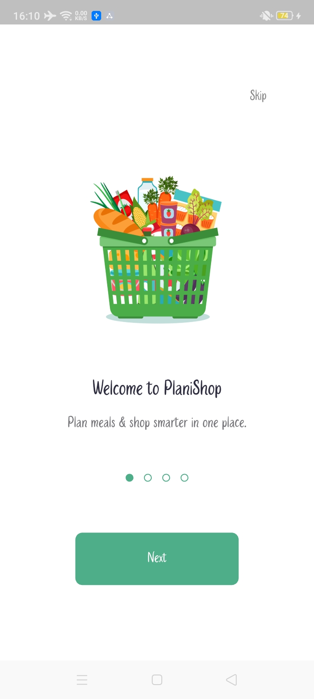 | 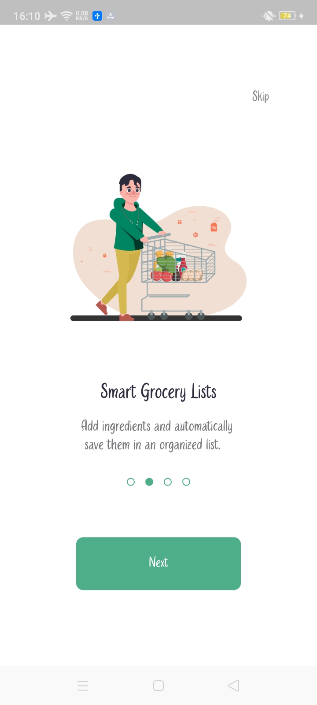 | 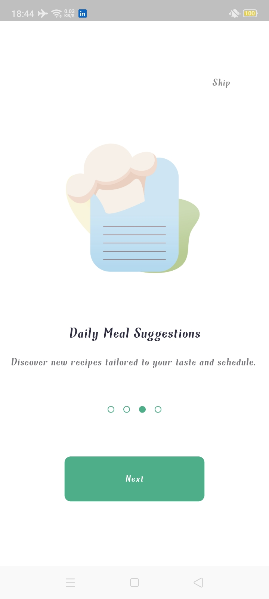 | 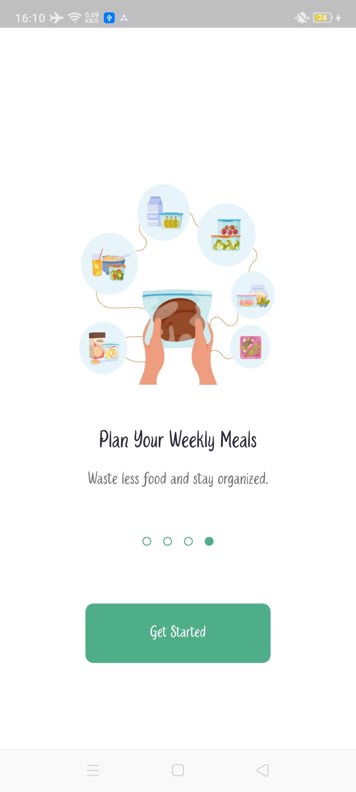 |

---

|                 Login With                  |                   Compelete Info                    |            Cart View             |
| :-----------------------------------------: | :-------------------------------------------------: | :------------------------------: |
| 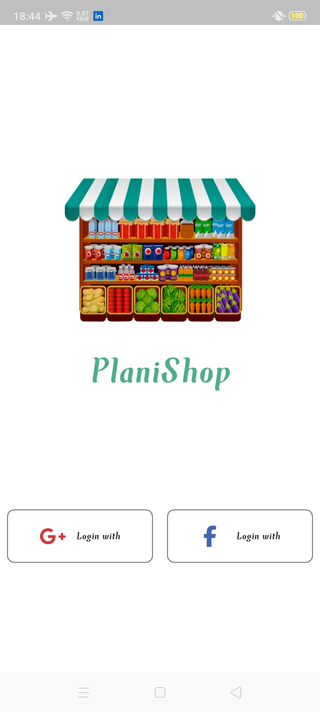 | 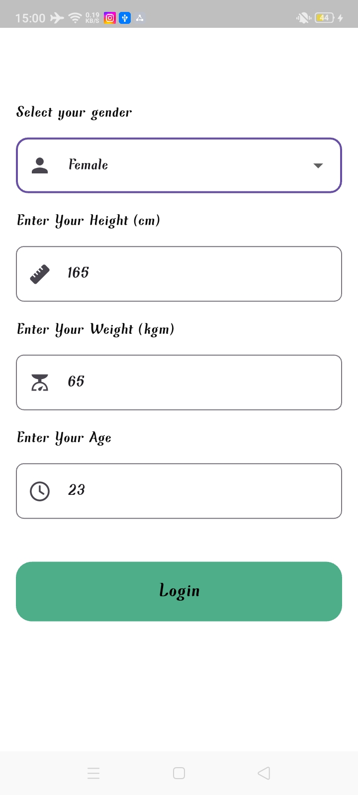 | 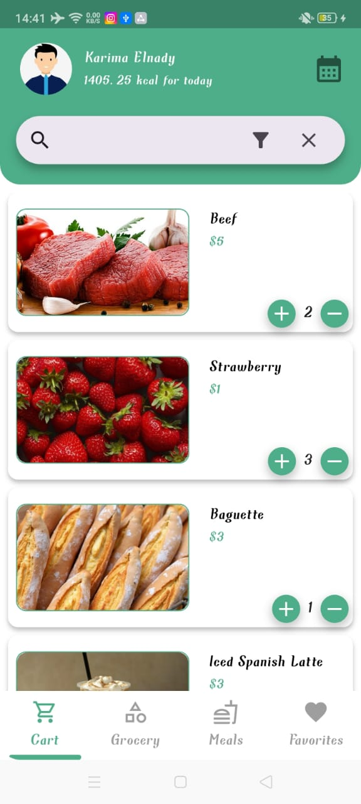 |

---

|                Grocery 1                 |                Grocery 2                 |                Grocery 3                 |                Grocery 4                 |                Grocery 5                 |
| :--------------------------------------: | :--------------------------------------: | :--------------------------------------: | :--------------------------------------: | :--------------------------------------: |
| 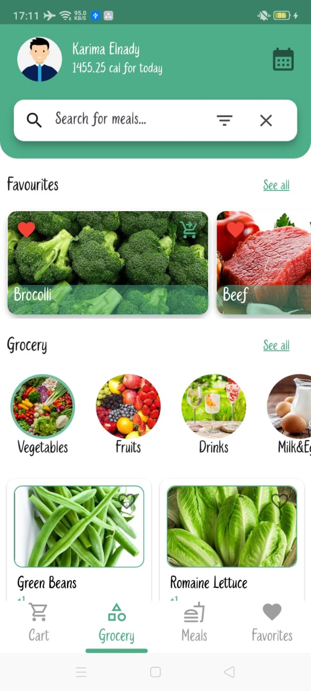 | 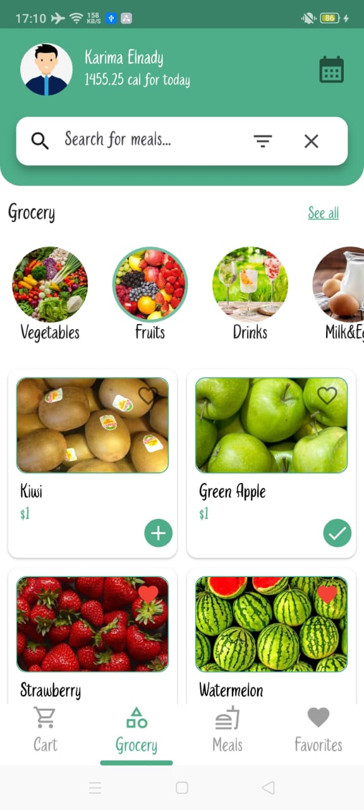 | 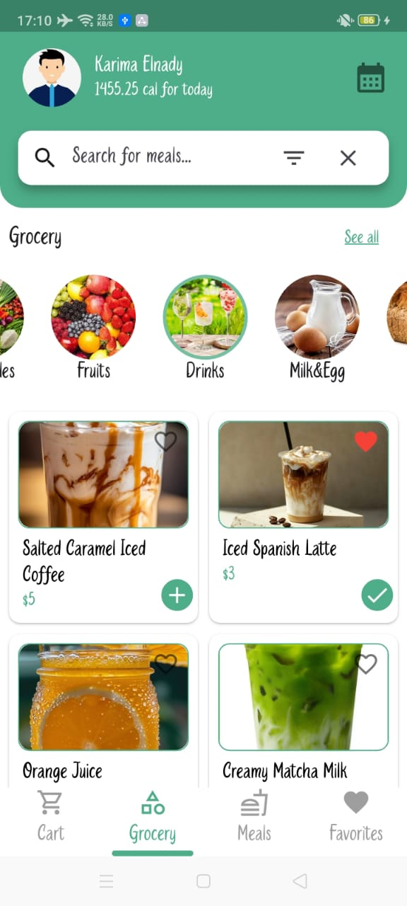 | 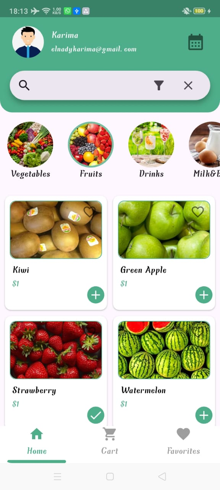 | 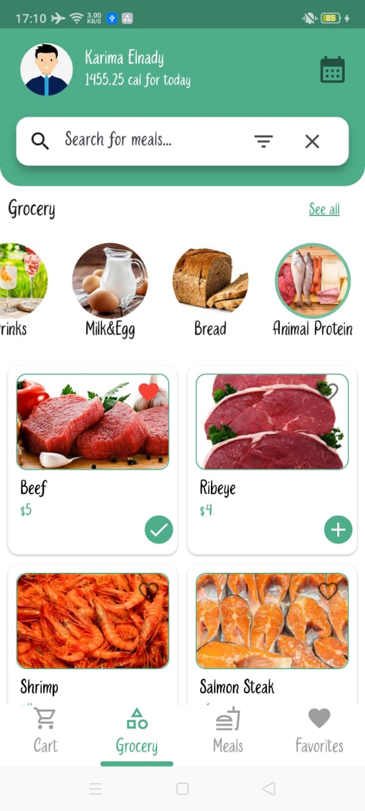 |

---

|                    SuggestedMeals                     |               FavouriteMeals               |                 WeeklyMealPlan                  |
| :---------------------------------------------------: | :----------------------------------------: | :---------------------------------------------: |
| 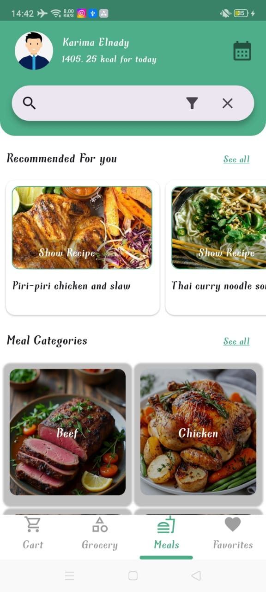 | 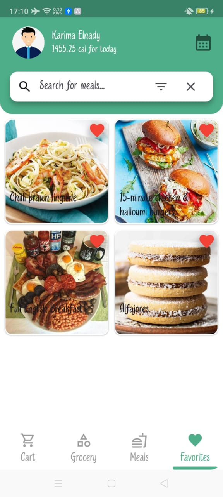 | 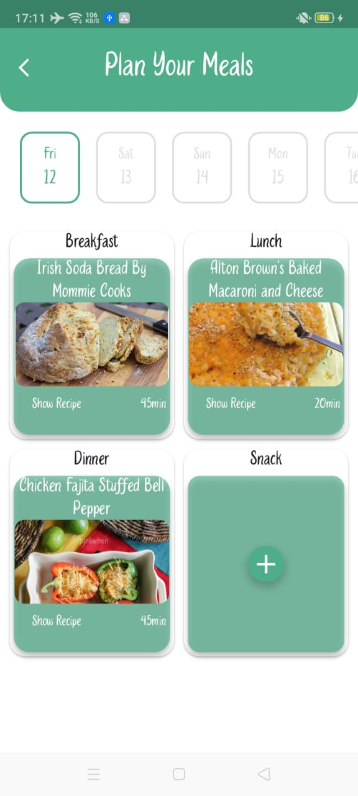 |

---

|                     MealCategories                     |                CategoryMeals                 |                        MealDescription                        |
| :----------------------------------------------------: | :------------------------------------------: | :-----------------------------------------------------------: |
| 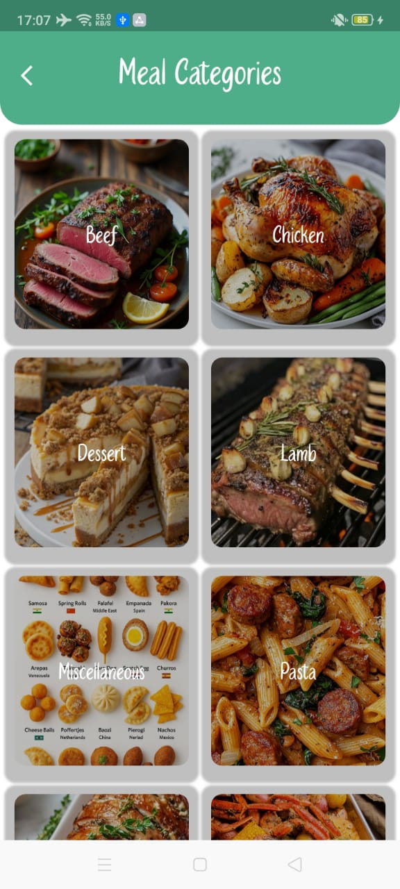 | 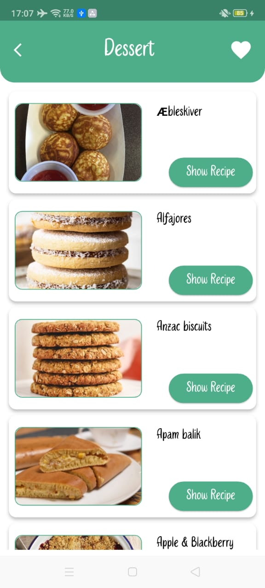 | 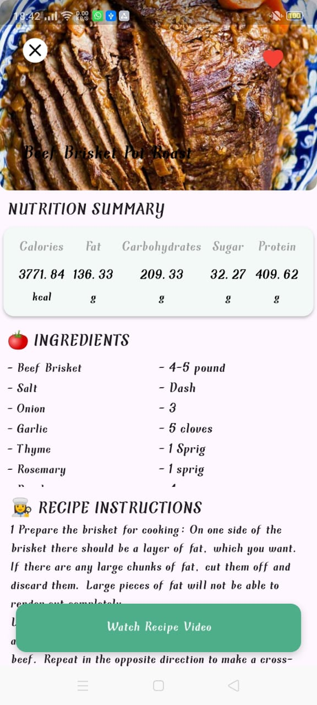 |

---

## 🏗️ Architecture & Design Patterns

This project follows **Clean Architecture** principles with clear separation of concerns:

```
lib/
├── main.dart                    # App entry point, Firebase init, MultiBlocProvider setup
│
├── core/                        # Shared utilities and resources
│   ├── config/                  # App-level configuration
│   ├── constants/               # App-wide constants (colors, keys, strings)
│   ├── di/                      # Dependency injection (reserved)
│   ├── errors/                  # Error handling (reserved)
│   ├── manager/                 # Global state management (CounterCubit)
│   ├── navigation/              # NavigationSell — PersistentBottomNavBar shell
│   ├── routes/                  # AppRoutes (constants) & RouteGenerator (onGenerateRoute)
│   ├── utils/                   # NavigationHelper (type-safe navigation), SizeConfig
│   └── widgets/                 # Reusable widgets (AppBar, SearchBar, buttons, etc.)
│
├── features/                    # Feature modules
│   ├── Auth/
│   │   ├── domain/              # Entities, repositories, use cases, CalorieCalculator
│   │   ├── data/                # UserModel, AuthRepoImpl
│   │   └── presentation/        # AuthCubit, Login, CompleteInfo pages
│   │
│   ├── home/
│   │   ├── domain/              # CartServices, CartRepo, FavRepo, GrocerryItemsRepo
│   │   ├── data/                # Cart/Fav/GrocerryItem models & repo implementations
│   │   └── presentation/        # CartCubit, FavouriteCubit, GrocerryItemsCubit, pages
│   │
│   ├── meals/
│   │   ├── domain/              # MealRepos (suggested, search, fav, nutrition)
│   │   ├── data/                # MealModel, FavMealModel, NutritionModels, repo impls
│   │   └── presentation/        # MealsCubit, FavMealsCubit, NutritionCubit, pages
│   │
│   ├── meal_planner/
│   │   ├── core/                # Planner-specific constants
│   │   ├── domain/              # MealPlannerRepo, GetWeekPlanUsecase
│   │   ├── data/                # DayMealPlan, WeekMealPlan, MealInfo models & repo impl
│   │   └── presentation/        # PlannerCubit, PlanView pages
│   │
│   ├── onBoarding/
│   │   └── presentation/        # Onboarding screens
│   │
│   └── splash/
│       └── presentation/        # Splash screen
│
└── services/                    # App-level services (reserved)
```

### Key Design Patterns

- **Clean Architecture**: Separation into Data, Domain, and Presentation layers per feature
- **Repository Pattern**: Abstract data sources behind repository interfaces
- **BLoC/Cubit Pattern**: State management using `Cubit` (via `flutter_bloc`) for all features
- **Use Case Pattern**: Business logic encapsulated in dedicated use case classes
- **Centralized Routing**: All routes defined in `AppRoutes`, generated by `RouteGenerator`, and accessed through `NavigationHelper` for type-safe navigation
- **Functional Error Handling**: `Either` type from `dartz` for elegant, exception-free error handling

---

## 🧭 Navigation System

The app uses a **centralized, type-safe routing architecture** composed of three layers:

### 1. `AppRoutes` — Route Constants

All route name strings are defined as static constants in `AppRoutes`, eliminating magic strings and preventing typos:

```dart
class AppRoutes {
  static const String splash = '/';
  static const String onboarding = '/onboarding';
  static const String login = '/login';
  static const String completeInfo = '/complete-info';
  static const String main = '/main';
  static const String mealCategories = '/meal-categories';
  static const String mealDescription = '/meal-description';
  static const String mealsView = '/meals-view';
  static const String favMeals = '/fav-meals';
  static const String favorites = '/favorites';
  static const String mealPlanner = '/meal-planner';
  // ...
}
```

### 2. `RouteGenerator` — Route Factory

The `RouteGenerator.generateRoute` method is wired to `MaterialApp.onGenerateRoute`. It maps route names to pages, validates required arguments (e.g., `UserModel` for `/main`, `MealModel` for `/meal-description`), and provides a user-friendly error screen for unknown routes.

### 3. `NavigationHelper` — Type-Safe Navigation API

`NavigationHelper` provides static methods for every destination, each accepting an optional `replace` parameter:

```dart
NavigationHelper.toMain(context, user: user, replace: true);
NavigationHelper.toMealDescription(context, meal: meal);
NavigationHelper.toMealCategories(context);
NavigationHelper.toPlan(context);
NavigationHelper.pop(context);
```

It also includes utility methods: `popUntil`, `popAndPushNamed`, `pushNamedAndRemoveUntil`, `canPop`, and `maybePop`.

### 4. `NavigationSell` — Bottom Navigation Shell

The main screen uses `PersistentTabView` (from `persistent_bottom_nav_bar`) to provide a four-tab layout with state preservation:

|  Tab Index  | Tab Name  |        Screen        |
| :---------: | :-------: | :------------------: |
|      0      |   Cart    |      `CartView`      |
| 1 (default) |  Grocery  |      `HomeView`      |
|      2      |   Meals   | `SuggestedMealsView` |
|      3      | Favorites |    `FavMealsView`    |

---

## 🔑 User Flow

1. **Splash Screen** → Animated splash with app logo
2. **Onboarding** → Multi-page introduction with dot indicators
3. **Login** → Google or Facebook authentication via Firebase
4. **Complete Info** → User provides gender, height, weight, and age; the app calculates BMR-based calorie needs using the Mifflin-St Jeor equation
5. **Main App** → Four-tab navigation:
   - **Grocery**: Browse grocery items by category, add items to cart or favorites
   - **Cart**: View cart items, track total calories and price, checkout with 70% calorie validation
   - **Meals**: Browse suggested meals, search meals by name, view meal categories, and view meal details with nutrition info
   - **Favorites**: View and manage favorite meals
6. **Meal Planner** → Accessed via the calendar icon in the app bar; displays a 7-day plan with per-day nutritional summaries (calories, fat, carbs, protein)
7. **Meal Description** → Detailed view of a meal including ingredients, recipe instructions, area/category info, and nutrition analysis from Spoonacular

---

## 🛠️ Tech Stack

### Framework & Language

- **Flutter** (Dart SDK ^3.7.0)
- **Target Platforms**: Android (iOS-ready architecture)

### State Management

- **flutter_bloc** (^9.1.1) — Primary state management using Cubit
- **bloc** (^9.0.1) — Core BLoC library
- **equatable** (^2.0.7) — Value equality for state classes

### Backend & Cloud Services

- **Firebase Authentication** (^6.0.2) — Social login (Google, Facebook)
- **Cloud Firestore** (^6.0.1) — Real-time database and synchronization
- **Firebase Core** (^4.1.0) — Firebase initialization

### APIs

- **TheMealDB API** — Meal database, recipes, categories, and meal search
- **Spoonacular API** — Detailed nutrition analysis, weekly meal plans

### Networking & Functional Programming

- **http** (^1.6.0) — HTTP client for API calls
- **dartz** (^0.10.1) — `Either` type for functional error handling

### UI/UX

- **lottie** (^3.3.1) — Lottie animations (splash, loading)
- **awesome_dialog** (^3.3.0) — Styled dialog boxes
- **dots_indicator** (^4.0.1) — Onboarding page indicators
- **persistent_bottom_nav_bar** (^6.2.1) — Persistent bottom navigation with state management
- **flutter_floating_bottom_bar** (^1.3.0) — Floating bottom bar widget
- **url_launcher** (^6.3.2) — Open external links (e.g., YouTube recipe videos)
- **intl** (^0.20.2) — Internationalization and date formatting
- **font_awesome_icon_class** (^0.0.6) — Font Awesome icons

### Authentication

- **google_sign_in** (^6.2.1) — Google Sign-In
- **flutter_facebook_auth** (^7.1.2) — Facebook Login

### Testing

- **bloc_test** (^10.0.0) — BLoC/Cubit testing utilities
- **mocktail** (^1.0.4) — Mocking framework
- **mockito** (^5.5.0) — Additional mocking support
- **build_runner** (^2.7.1) — Code generation

---

## 🚀 Getting Started

### Prerequisites

- Flutter SDK (3.7+)
- Dart SDK (3.7+)
- Android Studio / VS Code
- Firebase account
- API Keys (TheMealDB, Spoonacular)

### Installation

1. **Clone the repository**

```bash
git clone https://github.com/KarimaMahmoud626/Meal-Planning-App.git
cd Meal-Planning-App/meal_planning_app
```

2. **Install dependencies**

```bash
flutter pub get
```

3. **Firebase Setup**
   - Create a new Firebase project at [Firebase Console](https://console.firebase.google.com/)
   - Enable Authentication (Google & Facebook providers)
   - Enable Cloud Firestore
   - Download `google-services.json` (Android)
   - Place it in `android/app/`

4. **API Configuration**
   - Get API keys from:
     - [TheMealDB](https://www.themealdb.com/api.php)
     - [Spoonacular](https://spoonacular.com/food-api)
   - Update the API key constants in `lib/core/constants/constants.dart`:

   ```dart
   const kSpoonAcularApiKey = 'YOUR_SPOONACULAR_KEY';
   ```

5. **Run the app**

```bash
flutter run
```

---

## 🧪 Testing

Run unit tests:

```bash
flutter test
```

Tests cover:

- ✅ **BMR Calculation** — Validates Mifflin-St Jeor BMR for male and female profiles (`bmr_calculation_test.dart`)
- ✅ **Cart Services** — Total price, total calories, and calorie percentage calculations (`cart_services_test.dart`)
- ✅ **Cart Cubit** — State transitions for loading, loaded, empty, and error states with mocked repository (`cart_cubit_test.dart`)
- ✅ **Grocery Cubit** — State transitions for grocery item fetching with mocked repository (`grocery_cubit_test.dart`)

---

## 🎯 Key Technical Highlights

### Centralized Routing & Type-Safe Navigation

All routes are defined in `AppRoutes`, resolved by `RouteGenerator` with argument validation and error screens, and accessed via `NavigationHelper` for compile-time safety. The `NavigationSell` shell provides persistent bottom navigation with state preservation across tabs, using `rootNavigator: true` for full-screen route pushes from within tabs.

### Smart Cart Validation

The shopping cart implements BMR (Basal Metabolic Rate) calculation to ensure users meet at least 70% of their daily caloric needs before checkout, promoting healthy eating habits.

### Calorie Calculator (Mifflin-St Jeor Equation)

The `CalorieCalculator` service computes BMR using the Mifflin-St Jeor formula and can calculate TDEE (Total Daily Energy Expenditure) using an activity factor. This is used during user onboarding to set personalized calorie goals.

### Nutrition Analysis

The `NutritionCubit` fetches detailed per-meal nutrition data from the Spoonacular API, displaying calories, fat, carbohydrates, and protein with daily percentage values.

### Meal Search with SearchAnchor

The `CustomSearchBar` uses Flutter's `SearchAnchor` widget combined with the `MealsCubit` to provide real-time search results. Tapping the search bar loads suggested meals, and typing triggers a live search against the TheMealDB API.

### Custom API Mapping

Built a custom mapping layer to combine data from TheMealDB and Spoonacular, normalizing different API response structures into unified domain models.

### Real-time Synchronization

Leverages Firestore real-time listeners to keep meal plans and cart items synchronized across user sessions and devices.

### Clean Error Handling

Implements the `Either` type (via dartz) for elegant error handling without exceptions, making the codebase more predictable and maintainable.

---

## 📂 State Management Overview

The app registers the following Cubits at the root `MultiBlocProvider` in `main.dart`:

| Cubit                | Responsibility                                                         |
| :------------------- | :--------------------------------------------------------------------- |
| `GrocerryItemsCubit` | Fetches and manages grocery items by category                          |
| `CartCubit`          | Manages cart items, total calories, and total price                    |
| `FavouriteCubit`     | Manages favorite grocery items                                         |
| `AuthCubit`          | Handles authentication, user data, and profile completion              |
| `FavMealsCubit`      | Manages favorite meals (add, remove, update)                           |
| `MealsCubit`         | Fetches suggested meals, searches meals, gets meals by category/ID     |
| `PlannerCubit`       | Fetches the weekly meal plan from Spoonacular                          |
| `NutritionCubit`     | Fetches per-meal nutrition analysis (scoped per meal description page) |

---

## 🔮 Future Enhancements

- [ ] iOS build and testing
- [ ] Widget and integration tests
- [ ] Offline mode with local caching
- [ ] Recipe video integration
- [ ] Grocery list export functionality
- [ ] Meal sharing with friends
- [ ] Dietary restrictions filters (vegan, gluten-free, etc.)
- [ ] Barcode scanning for nutrition tracking

---

## 📄 License

This project is open source and available under the [MIT License](LICENSE).

---

## 👤 Author

**Karima Mahmoud Mohammed**

- GitHub: [@KarimaMahmoud626](https://github.com/KarimaMahmoud626)
- LinkedIn: [Karima Mahmoud](https://linkedin.com/in/KarimaMahmoud626)
- Email: karimamahmoud382@gmail.com

---

## 🙏 Acknowledgments

- [TheMealDB](https://www.themealdb.com/) - Free meal database API
- [Spoonacular](https://spoonacular.com/) - Nutrition & meal planning API
- [Flutter](https://flutter.dev/) - UI framework
- [Firebase](https://firebase.google.com/) - Backend services
- [persistent_bottom_nav_bar](https://pub.dev/packages/persistent_bottom_nav_bar) - Bottom navigation with state preservation

---

**⭐ If you found this project helpful, please consider giving it a star!**
