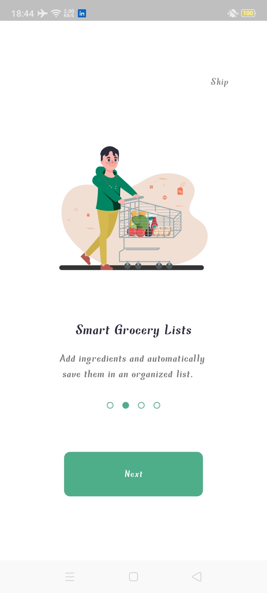
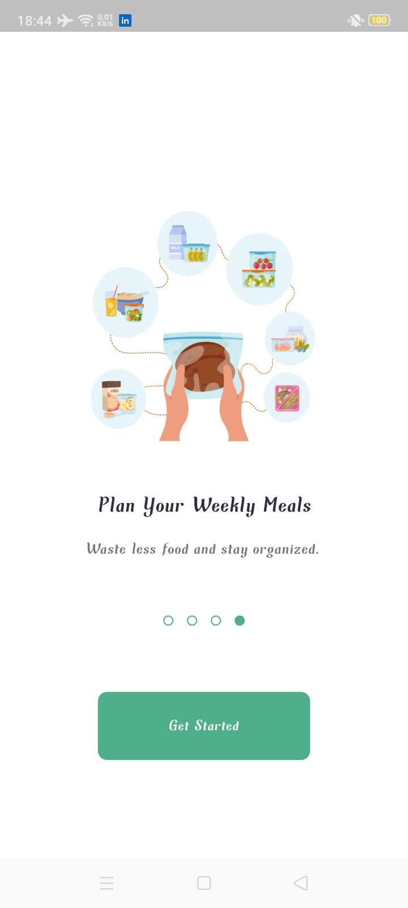
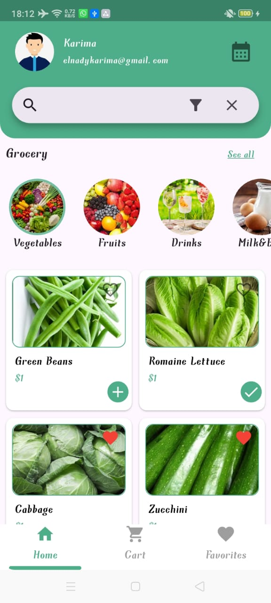
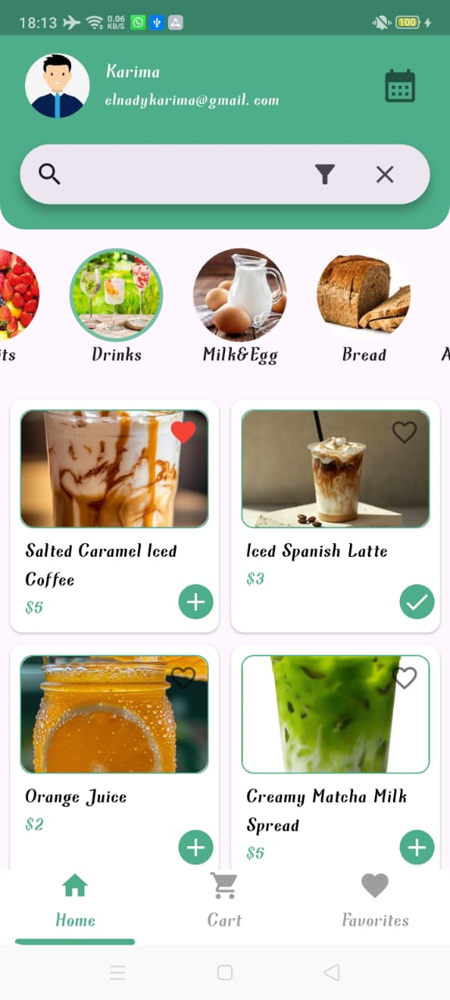
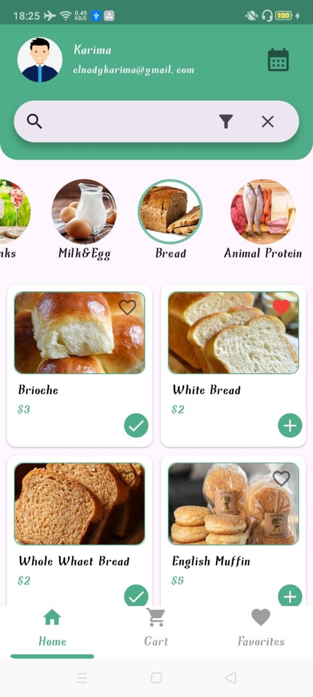

# 🍽️ Meal Planning App

A comprehensive cross-platform meal planning application built with Flutter, featuring personalized nutrition tracking, smart shopping cart validation, and a 7-day meal planner. This app helps users maintain healthy eating habits by providing calorie-based meal recommendations and ensuring nutritional requirements are met.

---

## ✨ Features

### Core Features
- **Dual API Integration**: Combines TheMealDB and Spoonacular APIs for extensive meal database and detailed nutrition information
- **7-Day Meal Planner**: Plan your meals for the entire week with dynamic calorie calculations
- **Smart Shopping Cart**: BMR-based validation requiring 70% daily calorie minimum before checkout
- **Real-time Sync**: Firebase Firestore integration for seamless data synchronization across devices
- **Personalized Nutrition**: Custom calorie recommendations based on user health metrics (weight, height, age, activity level)
- **Social Authentication**: Google and Facebook login via Firebase Authentication

### User Experience
- Browse meals by categories
- Search functionality for quick meal discovery
- Detailed nutritional information for each meal
- Add meals to favorites for quick access
- Track daily calorie intake
- Receive health-based meal recommendations

---

## 📱 Screenshots

| Splash_View | Onboarding 1 | Onboarding 2 | Onboarding 3 | Onboarding 4 |  
|:------------:|:------------:|:------------:|:------------:|:------------:|
|  |  |  |  |  |

---

| Login With | Compelete Info | Cart View |   
|:----------:|:--------------:|:---------:|
|  |  |  |  

---

| Grocery 1 | Grocery 2 | Grocery 3 | Grocery 4 | Grocery 5 |  
|:---------:|:---------:|:---------:|:---------:|:---------:|
|  |  |  |  |  |  

---

| SuggestedMeals | FavouriteMeals | WeeklyMealPlan | 
|:--------------:|:--------------:|:--------------:|
|  |  |  

---

| MealCategories | CategoryMeals | MealDescription |  
|:--------------:|:-------------:|:---------------:|
| |  |  |  

---

---

## 🏗️ Architecture & Design Patterns

This project follows **Clean Architecture** principles with clear separation of concerns:

```
lib/
├── core/                    # Shared utilities and resources
│   ├── constants/          # App-wide constants (colors, strings, etc)
│   ├── utils/              # Helper functions and utilities
│   ├── widgets/            # Reusable widgets
│   └── manager/            # Global state/resource management
│
├── features/               # Feature modules
│   ├── auth/
│   │   ├── domain/        # Business logic (entities, use cases)
│   │   ├── data/          # Data layer (models, repositories, data sources)
│   │   └── presentation/  # UI layer (pages, widgets, BLoC/Cubit)
│   │
│   ├── home/
│   │   ├── domain/
│   │   ├── data/
│   │   └── presentation/
│   │
│   ├── meals/
│   │   ├── domain/
│   │   ├── data/
│   │   └── presentation/
│   │
│   ├── onboarding/
│   │   └── presentation/
│   │
│   └── splash/
│       └── presentation/
│
└── main.dart               # App entry point
```

### Key Design Patterns
- **Clean Architecture**: Separation into Data, Domain, and Presentation layers
- **Repository Pattern**: Abstract data sources behind repository interfaces
- **BLoC Pattern**: State management using Cubit and BLoC
- **Dependency Injection**: Decoupled components for testability

---

## 🛠️ Tech Stack

### Framework & Language
- **Flutter** (Dart)
- **Target Platform**: Android (iOS-ready architecture)

### State Management
- **flutter_bloc** (9.1.1) - Primary state management
- **Cubit** - For simpler state scenarios
- **setState** - For local widget state

### Backend & Cloud Services
- **Firebase Authentication** - Social login (Google, Facebook)
- **Cloud Firestore** - Real-time database and synchronization
- **Firebase Core** - Firebase initialization

### APIs
- **TheMealDB API** - Meal database and recipes
- **Spoonacular API** - Detailed nutrition information and analysis

### Testing
- **bloc_test** (10.0.0) - BLoC/Cubit testing
- **mocktail** (1.0.4) - Mocking dependencies
- **Unit Tests** - Services and state management logic

### Key Dependencies
```yaml
# State Management
flutter_bloc: ^9.1.1
bloc: ^9.0.1
equatable: ^2.0.7

# Firebase
firebase_auth: ^6.0.2
firebase_core: ^4.1.0
cloud_firestore: ^6.0.1

# Authentication
google_sign_in: ^6.2.1
flutter_facebook_auth: ^7.1.2

# Networking
http: ^1.6.0

# Functional Programming
dartz: ^0.10.1

# UI/UX
lottie: ^3.3.1
awesome_dialog: ^3.3.0
dots_indicator: ^4.0.1
persistent_bottom_nav_bar: ^6.2.1
flutter_floating_bottom_bar: ^1.3.0

# Testing
bloc_test: ^10.0.0
mocktail: ^1.0.4
```

---

## 🚀 Getting Started

### Prerequisites
- Flutter SDK (3.0+)
- Dart SDK (3.0+)
- Android Studio / VS Code
- Firebase account
- API Keys (TheMealDB, Spoonacular)

### Installation

1. **Clone the repository**
```bash
git clone https://github.com/KarimaMahmoud626/Meal-Planning-App.git
cd Meal-Planning-App
```

2. **Install dependencies**
```bash
flutter pub get
```

3. **Firebase Setup**
   - Create a new Firebase project at [Firebase Console](https://console.firebase.google.com/)
   - Enable Authentication (Google & Facebook providers)
   - Enable Cloud Firestore
   - Download `google-services.json` (Android)
   - Place it in `android/app/`

4. **API Configuration**
   - Get API keys from:
     - [TheMealDB](https://www.themealdb.com/api.php)
     - [Spoonacular](https://spoonacular.com/food-api)
   - Create `lib/core/utils/api_constants.dart`:
   ```dart
   class ApiConstants {
     static const String mealDbApiKey = 'YOUR_MEALDB_KEY';
     static const String spoonacularApiKey = 'YOUR_SPOONACULAR_KEY';
   }
   ```

5. **Run the app**
```bash
flutter run
```

---

## 🧪 Testing

Run unit tests:
```bash
flutter test
```

Tests cover:
- ✅ API service layer
- ✅ Repository implementations
- ✅ BLoC/Cubit state management
- ✅ Use case business logic

---

## 🎯 Key Technical Highlights

### Smart Cart Validation
The shopping cart implements BMR (Basal Metabolic Rate) calculation to ensure users meet at least 70% of their daily caloric needs before checkout, promoting healthy eating habits.

### Custom API Mapping
Built custom mapping layer to combine data from TheMealDB and Spoonacular, normalizing different API response structures into unified domain models.

### Real-time Synchronization
Leverages Firestore real-time listeners to keep meal plans and cart items synchronized across user sessions and devices.

### Clean Error Handling
Implements Either type (via dartz) for elegant error handling without exceptions, making the codebase more predictable and maintainable.

---

## 📂 Project Structure

```
lib/
├── main.dart
│
├── core/
│   ├── constants/          # App constants, colors, text styles
│   ├── utils/              # Helper functions, validators, formatters
│   ├── widgets/            # Shared UI components
│   └── manager/            # Global managers (theme, navigation, etc)
│
└── features/
    ├── splash/
    │   └── presentation/   # Splash screen UI
    │
    ├── onboarding/
    │   └── presentation/   # Onboarding screens
    │
    ├── auth/
    │   ├── domain/
    │   │   ├── entities/
    │   │   ├── repositories/
    │   │   └── usecases/
    │   ├── data/
    │   │   ├── models/
    │   │   ├── datasources/
    │   │   └── repositories/
    │   └── presentation/
    │       ├── cubit/ or bloc/
    │       ├── pages/
    │       └── widgets/
    │
    ├── home/
    │   ├── domain/
    │   ├── data/
    │   └── presentation/
    │
    └── meals/
        ├── domain/
        ├── data/
        └── presentation/
```

---

## 🔮 Future Enhancements

- [ ] iOS build and testing
- [ ] Widget and integration tests
- [ ] Offline mode with local caching
- [ ] Recipe video integration
- [ ] Grocery list export functionality
- [ ] Meal sharing with friends
- [ ] Dietary restrictions filters (vegan, gluten-free, etc.)
- [ ] Barcode scanning for nutrition tracking

---

## 📄 License

This project is open source and available under the [MIT License](LICENSE).

---

## 👤 Author

**Karima Mahmoud Mohammed**
- GitHub: [@KarimaMahmoud626](https://github.com/KarimaMahmoud626)
- LinkedIn: [Karima Mahmoud](https://linkedin.com/in/KarimaMahmoud626)
- Email: karimamahmoud382@gmail.com

---

## 🙏 Acknowledgments

- [TheMealDB](https://www.themealdb.com/) - Free meal database API
- [Spoonacular](https://spoonacular.com/) - Nutrition API
- [Flutter](https://flutter.dev/) - UI framework
- [Firebase](https://firebase.google.com/) - Backend services

---

**⭐ If you found this project helpful, please consider giving it a star!**
